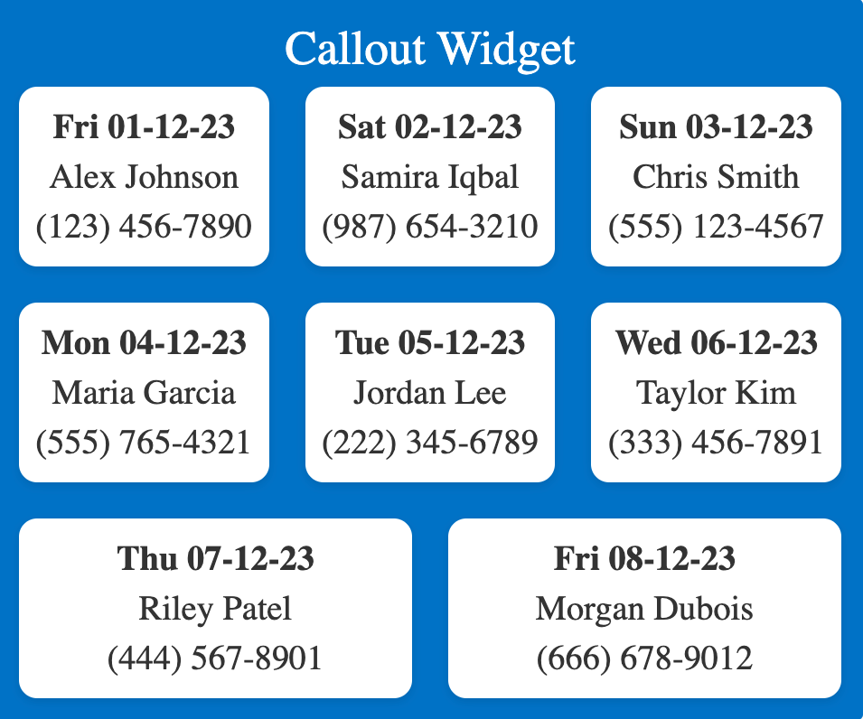
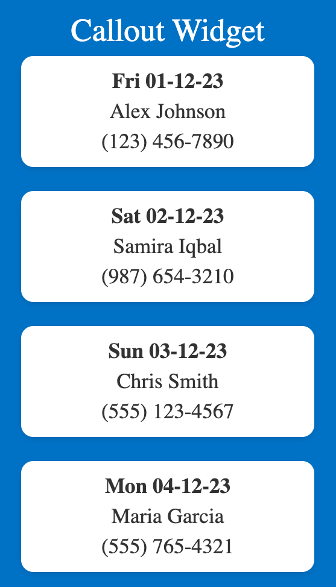
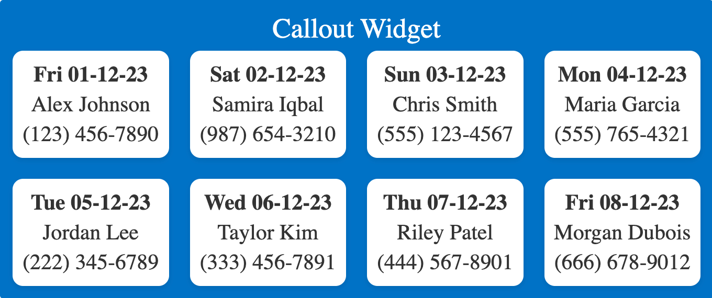
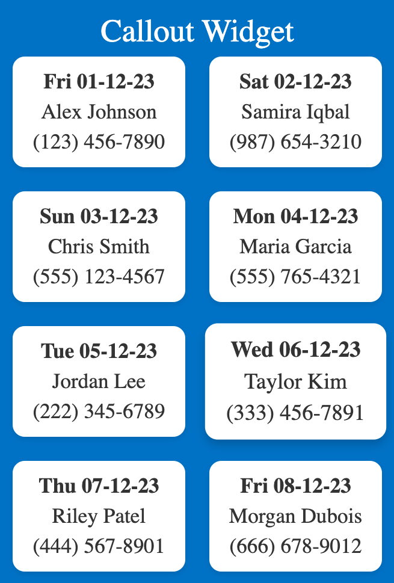
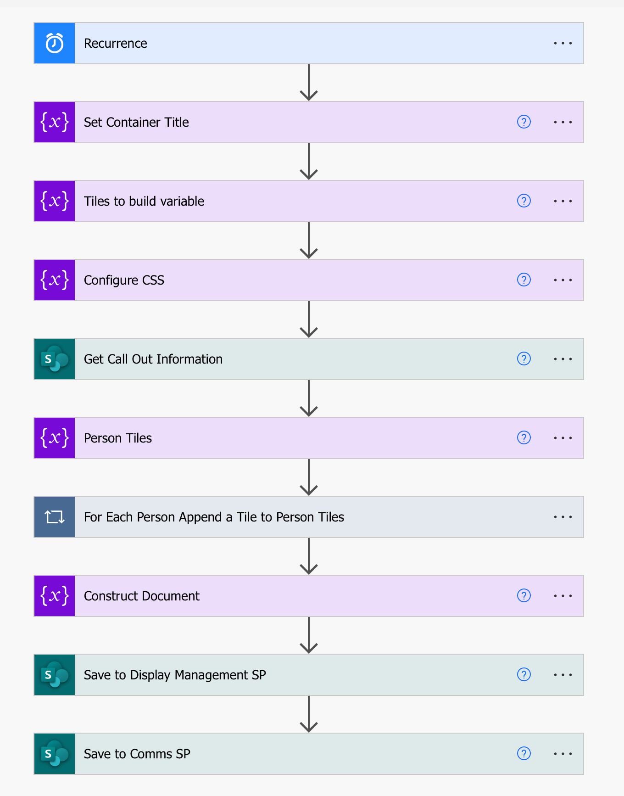

# Callout Widget

## Project Description:
The Callout Widget is a dynamic, versatile web component collection designed to create visually engaging callouts for user information. Perfect for dashboards, contact lists, or event calendars, it enhances user interfaces with its customizable and responsive design.

### Features:
- **Dynamic Content Rendering**: Automatically generates user information tiles based on data input.
- **Responsive Design**: Adapts elegantly to various screen sizes and resolutions, ensuring consistent UX across devices.
- **Customizable Styles**: Comes with a CSS file that allows easy customization to match any brand or design requirements.
- **Interactive Example**: A live HTML file to demonstrate the widget's functionality and interactivity.
- **Power Automate Integration**: Includes a flow example for automation with Microsoft Power Automate.

### Installation:
To integrate the Callout Widget Suite into your project:
1. Download the project files from the repository.
2. Include the `callout-widget.css` in your project's style directory.
3. Add the `callout-widget.html` to your project's component directory.

### Usage:
To use the Callout Widget Suite in your application:
1. Reference the CSS file in your HTML document head.
2. Include the `callout-widget.html` where you want the widget to appear.
3. Customize the content by modifying the `callout-widget-template.html` and associated style templates.
4. View the [interactive example](callout-widget.html){:target="_blank"} to see the widget in action.

### Contributing:
Contributions are welcome! To contribute:
1. Fork the repository.
2. Create a feature branch: `git checkout -b new-feature`
3. Commit your changes: `git commit -am 'Add some feature'`
4. Push to the branch: `git push origin new-feature`
5. Submit a pull request.

### License:
This project is licensed under the MIT License - see the LICENSE file for details.

---

**Examples:**

- **Mixed Layout Example**: Showcases a mixed layout presentation.
  

- **Single Column Example**: Demonstrates a single column layout for simpler displays.
  

- **Compact Size Example**: A compact layout for when space is at a premium.
  

- **Two Column Example**: Illustrates a two-column layout for medium-density information display.
  

- **Power Automate Flow**: Provides a visual example of integrating the widget with a Power Automate flow.
  

To view a live example of the Callout Widget, click [here](callout-widget.html){:target="_blank"} to open it in a new window.